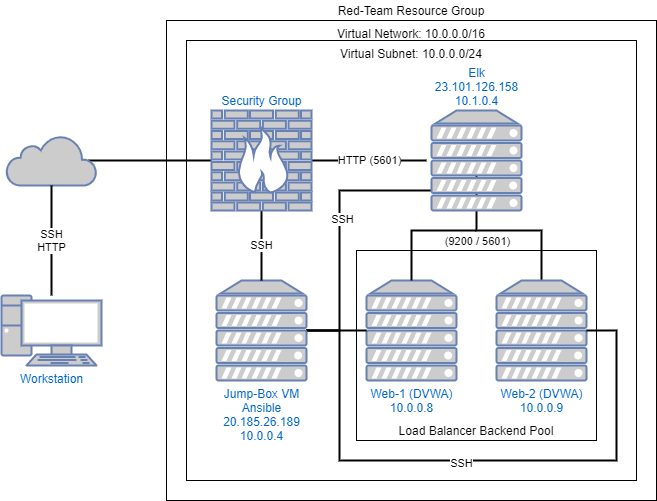
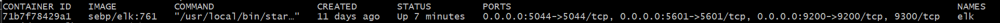

## Automated ELK Stack Deployment

The files in this repository were used to configure the network depicted below.

These files have been tested and used to generate a live ELK deployment on Azure. They can be used to either recreate the entire deployment pictured above. Alternatively, select portions of the various yml files may be used to install only certain pieces of it, such as Filebeat.

  - Ansible/install-elk.yml
  - Ansible/roles/filebeat-playbook.yml
  - Ansible/roles/metricbeat-playbook.yml

This document contains the following details:
- Description of the Topology
- Access Policies
- ELK Configuration
  - Beats in Use
  - Machines Being Monitored
- How to Use the Ansible Build

### Description of the Topology

The main purpose of this network is to expose a load-balanced and monitored instance of DVWA, the D*mn Vulnerable Web Application.

Load balancing ensures that the application will be highly available and reliable, in addition to restricting traffic to the network.
- Load balances can help protect against large increases in traffic including from denial of service attacks.

Integrating an ELK server allows users to easily monitor the vulnerable VMs for changes to the docker services and system  configuration.
- Filebeat watches for changes to the system configuration
- Metricbeat records docker statistics

The configuration details of each machine may be found below.

| Name     | Function | IP Address | Operating System |
|----------|----------|------------|------------------|
| Jump Box | Gateway  | 10.0.0.4   | Ubuntu 18.04-LTS |
| Web-1    | DVWA     | 10.0.0.8   | Ubuntu 18.04-LTS |
| Web-2    | DVWA     | 10.0.0.9   | Ubuntu 18.04-LTS |
| Elk      | Monitor  | 10.1.0.4   | Ubuntu 18.04-LTS |

### Access Policies

The machines on the internal network are not exposed to the public Internet. 

Only the Jump-Box machine can accept connections from the Internet. Access to this machine is only allowed from the following IP addresses:
- XXX.XXX.XXX.XXX (redacted for privacy)

Machines within the network can only be accessed by the Jump Box.
- _TODO: Which machine did you allow to access your ELK VM? What was its IP address?_

A summary of the access policies in place can be found in the table below.

| Name     | Publicly Accessible | Allowed IP Addresses |
|----------|---------------------|----------------------|
| Jump Box | Yes                 |XXX.XXX.XXX.XXX (redacted)|
| Elk      | No                  |10.0.0.8 10.0.0.9     |
| Web-1    | No                  |10.1.0.4              |
| Web-2    | No                  |10.1.0.4              |

### Elk Configuration

Ansible was used to automate configuration of the ELK machine. No configuration was performed manually, which is advantageous because...
- the server can be quickly removed and relaunched.

The playbook implements the following tasks:
- Installs docker.io and python3-pip through apt
- Installs the docker pip module
- Runs a sysctl command to increase virtual memory
- Enables the docker service on boot
- Downloads and launches a docker ELK container

The following screenshot displays the result of running `docker ps` after successfully configuring the ELK instance.

### Target Machines & Beats
This ELK server is configured to monitor the following machines:
- Web-1 (10.0.0.8)
- Web-2 (10.0.0.9)

We have installed the following Beats on these machines:
- filebeat
- metricbeat

These Beats allow us to collect the following information from each machine:
- `filebeat` collects logs created by the system logging service, which we use to track system events such as starting and stopping services, new and removed sessions, etc.
- `metricbeat` collects metrics, and in this case with the docker module will collect metrics about running docker containers.

### Using the Playbook
In order to use the playbook, you will need to have an Ansible control node already configured. Assuming you have such a control node provisioned: 

SSH into the control node and follow the steps below:
- Copy the Ansible/* files to /etc/ansible/.
- Update /etc/ansible/hosts to add your elk server and the target servers to install the beats on.
- Update the install-elk.yml, roles/filebeat-playbook.yml, and roles/metricbeat-playbook.yml files to include the correct hosts and remote_user parameters.
- Update files/*-config.yml files to have the correct hosts IP:PORT, username, and password.
- Run the playbooks, and navigate to http://ElkServerIp:5601 to check that the installation worked as expected.
